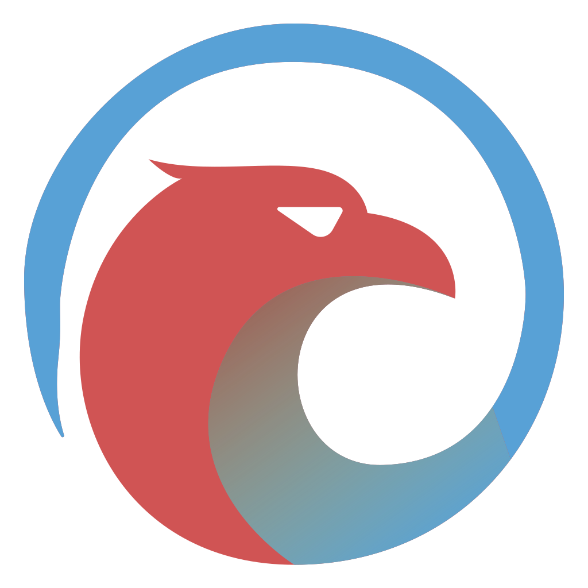

<p align="center">
	<a href="https://cycosoft.com/">
		
	</a>
</p>

<div align="center">
  <h1>Eyas</h1>
</div>
<p align="center">A "shift-left" serverless testing solution for static web applications by <a href="https://cycosoft.com">Cycosoft, LLC</a></p>

<p align="center">

</p>

<br />
<br />

## Table of Contents

- [The Why](#the-why)
- [Features](#features)
- [Install](#install)
- [Configuration](#configuration)
- [Usage](#usage)
- [Tips](#tips)
- [Support](#support)
- [Attribution](#attribution)

## The Why

The best time to test your changes is _before_ you merge them, but setting up a development environment on everyone's computer doesn't scale. The standard solution is to merge the code, and test it down the line in a staging environment where a simple bug might block the entire team from shipping. An emerging trend is to deploy each branch to an ephemeral environment, but this can be costly and time consuming to set up for all but the largest companies.

_Eyas_ leverages a packaged version of your application to provide a fast, shareable, and serverless testing solution. Regardless of your team size, you can now decrease the feedback loop for no extra cost. You can easily include PMs, designers, executives and customers in the testing process.

## Features

- 📈 **Speed & Stability** - Ship faster and increase confidence in your application by testing _before merge_
- 🤝 **Shareability** - No special tools needed on your target machines. Share your demo with your team, company or even customers as a downloadable file.
- 📦 **Serverless** - No need to manage a deployment server
- 🔗 **Cross-platform** - Test your application in multiple environments
- 💰 **Cost** - Free to implement

## Install

```bash
# Install the package
npm install @cycosoft/eyas --save-dev
```

## Configuration

```js
// <projectRoot>/.eyasrc.js
module.exports = {
  test: {
    // The path to the directory containing your application files
    source: `dist`,
    // The port your application will be served on via localhost
    port: 3000,
    // Run your application from any domain locally instead of localhost
    domain: null,
    // Define custom routes for your test
    routes: [/* { from: `/my-route`, to: `/demo/alt` } */],
    // The name of your application
    title: `Eyas`,
    // The version of your application that was built. Defaults to current branch name.
    version: `<current-branch>`,
    // Additional resolutions to test your application at
    resolutions: [/* { label: `iPad Pro`, width: 1024, height: 1366 } */],
    // Custom links to display in the menu
    menu: [/* { label: `Cycosoft, LLC`, url: `cycosoft.com` } */]
  }
};
```

## Usage

```json
// package.json
{
  "scripts": {
    "interactive": "eyas", // Select from a list of avaiable commands
    "quick": "eyas preview", // Preview the your app without compiling
    "share": "eyas compile" // Compiles the configured app to a distributable
  }
}
```

## Tips

- Add `eyas-*` to your `.gitignore` to prevent output from being committed to your repo
- Windows executables can sometimes be slower to launch due to Microsoft Defender
- This tool disables certain security features of the browser, **and should not be used in production environments.**

## Support

Support is available via <support+eyas@cycosoft.com>

## Attribution

This project includes code and assets from the following sources:

- Project Logo [Freepik](https://www.freepik.com/free-vector/eagle-logo-design-template_45007164.htm)